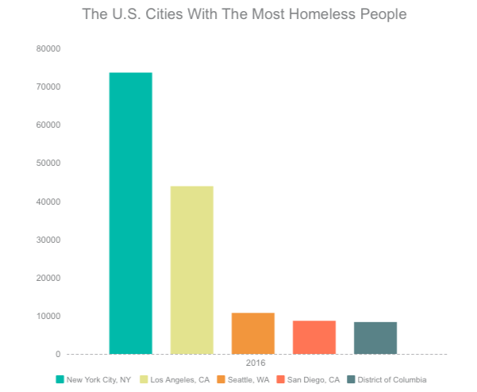
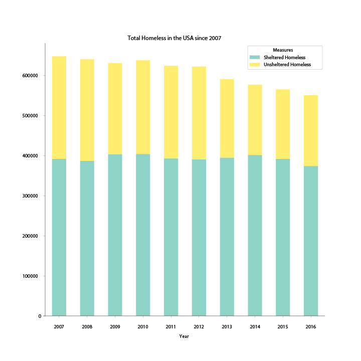
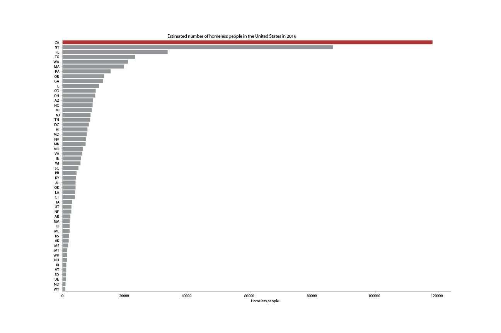
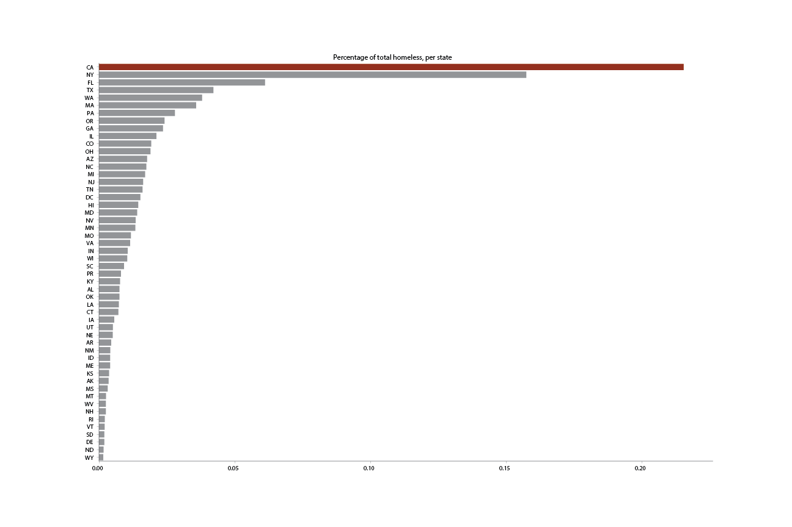
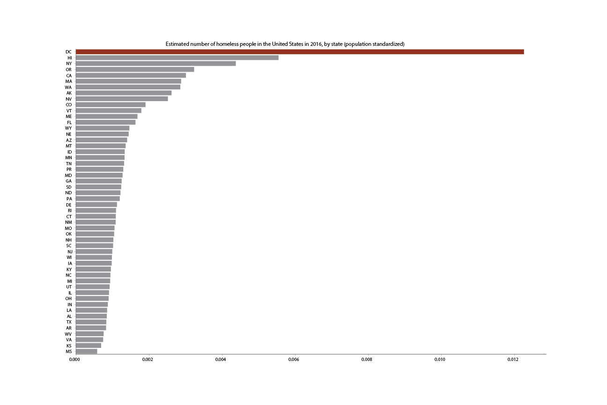
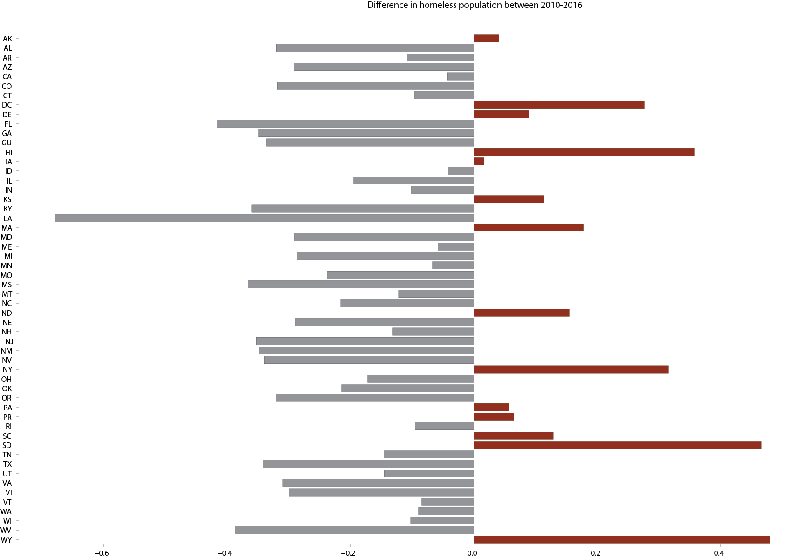

---

title: A Very Cool Project
layout: project

---

# New York, the city of the homeless

With currently over 70,000 homeless residents, 3,591 of which are sleeping on the streets, New York has the largest homeless population in the entire U.S. 

Though the homeless population has been reduced in most states, the battle against homelessness never ends. 

## The U.S. States With The Most Homeless People

Approximately 550,000 people in the United States are homeless with the majority of them living on the streets or in shelters in New York or California. 

The largest number of homeless people is recorded in California, where 118,143 people are experiencing homelessness while in the state of New York the number of total homeless is 86,352. 

At state level, California accounts for 21 percent of homeless individuals in the United States. Half of the country's homeless population is spread across five states: California, New York, Florida, Texas and Washington.

Compared to the total population of every state, the District of Columbia has the highest rate of homelessness.

The total homeless population in 2016 represents significant progress. For most states that figure is down. 

Some states made great progress resolving the problem. Florida reduced the homeless population by 83% since 2010, while in New York 
the number of homeless increased instead of decreasing. In total, 20,746 New Yorkers became homeless over the past 6 years, with a total increase of 63 % since 2010.  

